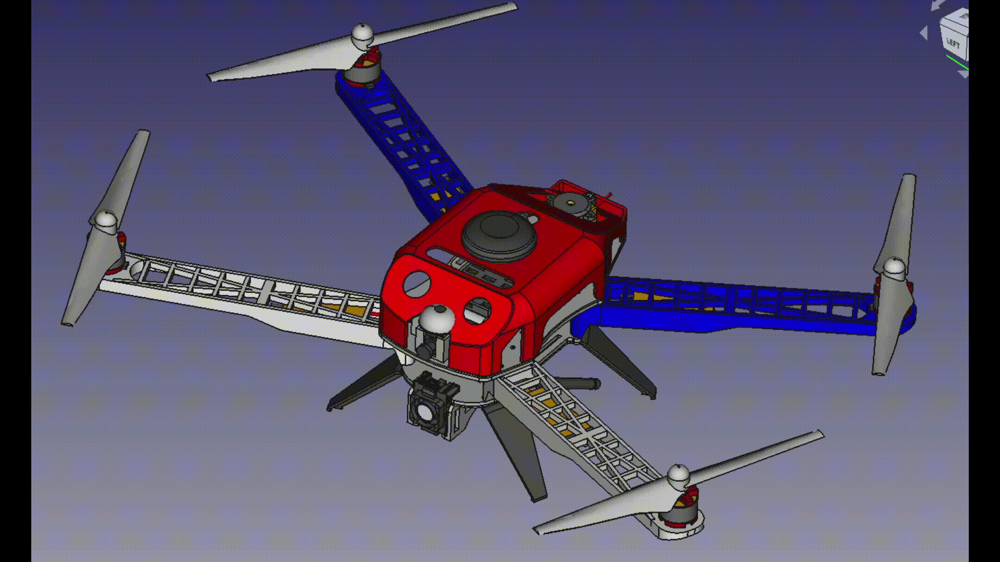

# ISR Hawk

Custom quadcopter airframe based on the IRIS models 3DR published awhile ago. 

Works with generic PX4 parts from Amazon. Pretty stable flight. Integrates a Jevois camera/cpu module.

All parts were printed on an Ender3 using PETG.

